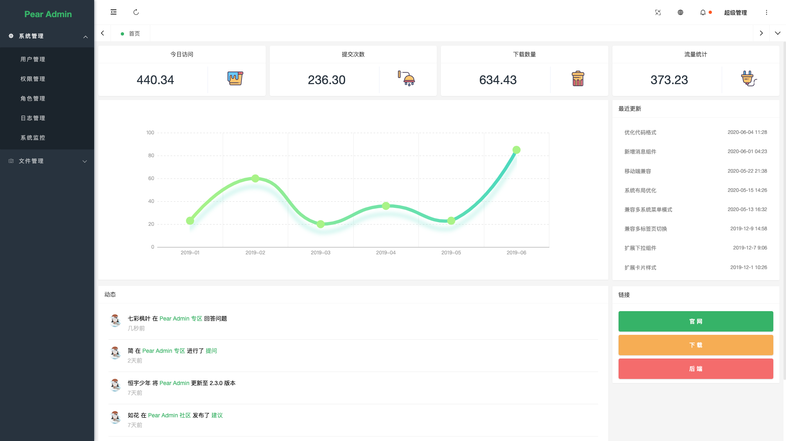
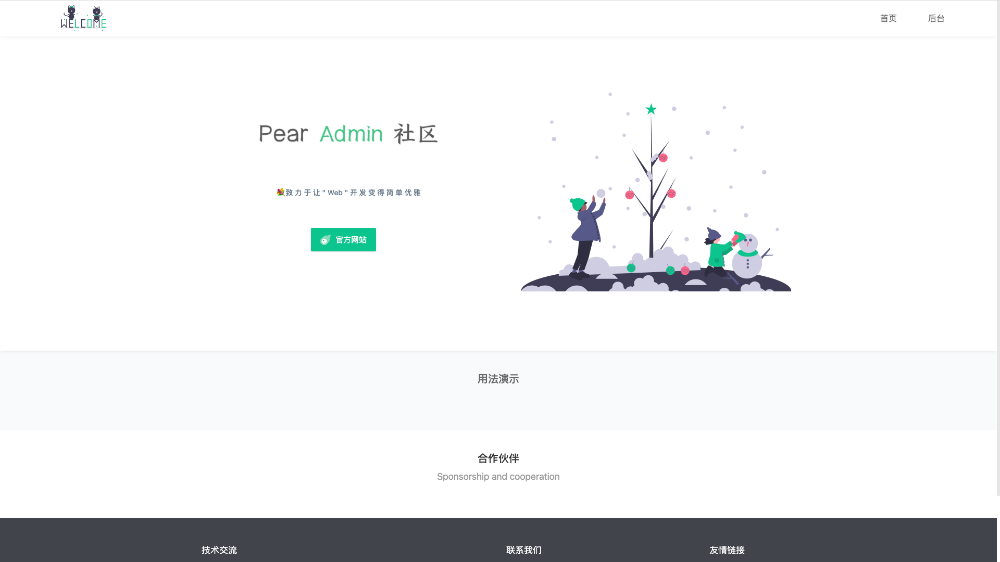
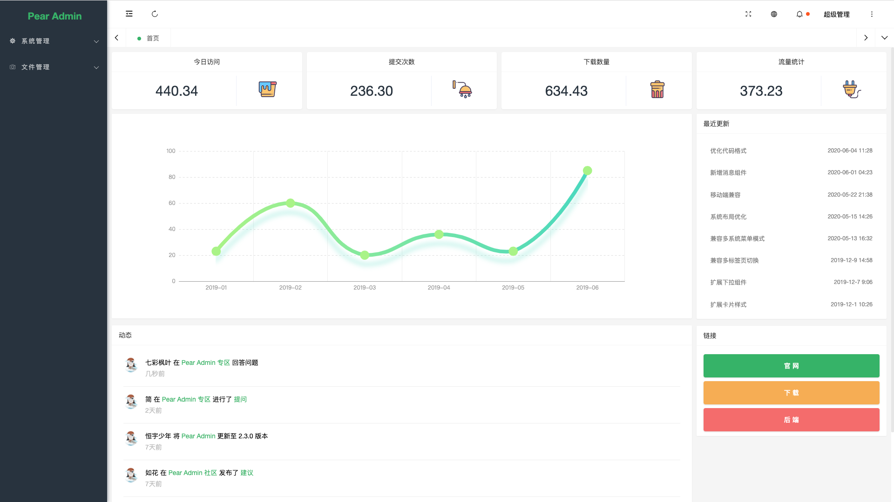
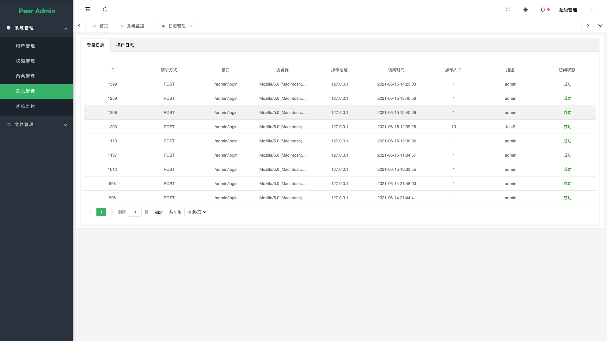
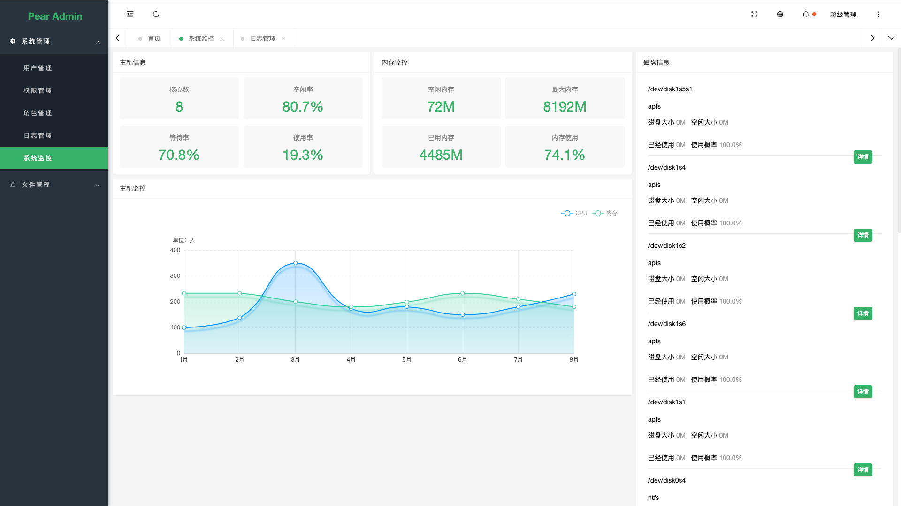
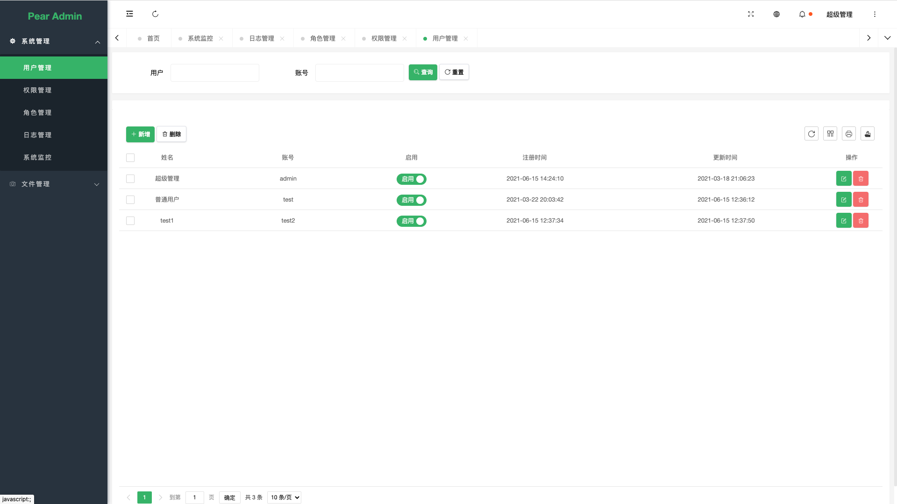

 
 

  <h1 align="center">
    Pear Admin FastAPI
  </h1>
  <h4 align="center">
    开 箱 即 用 的 FastAPI 快 速 开 发 平 台
  </h4> 

  [预 览](http://flask.pearadmin.com)   |   [官 网](http://www.pearadmin.com/)   |   [群聊](https://jq.qq.com/?_wv=1027&k=5OdSmve)   |   [社区](http://forum.pearadmin.com/)

  

#### 项目简介
>Pear Admin FastAPI 基于 FastAPI  的后台管理系统，拥抱应用广泛的python语言，通过使用本系统，即可快速构建你的功能业务
>
>项目旨在为python开发者提供一个后台管理系统的模板，成为您构建信息管理系统，物联网后台....等等应用时灵活，简单的工具
>
>各位Python爱好者多多指教

####  内置功能

- [x] 用户管理：用户是系统操作者，该功能主要完成系统用户配置。
- [x] 权限管理：配置系统菜单，操作权限，按钮权限标识等。
- [x] 角色管理：角色菜单权限分配。
- [x] 操作日志：系统正常操作日志记录和查询；系统异常信息日志记录和查询。
- [x] 登录日志：系统登录日志记录查询包含登录异常。
- [x] 服务监控：监视当前系统CPU、内存、磁盘、python版本,运行时长等相关信息。
- [x] 文件上传:   图片上传示例
- [ ] 代码生成:   构想中....

#### 预览项目

|  |  |
|---------------------|---------------------|
|   |   |
| |     |
|  |     |
